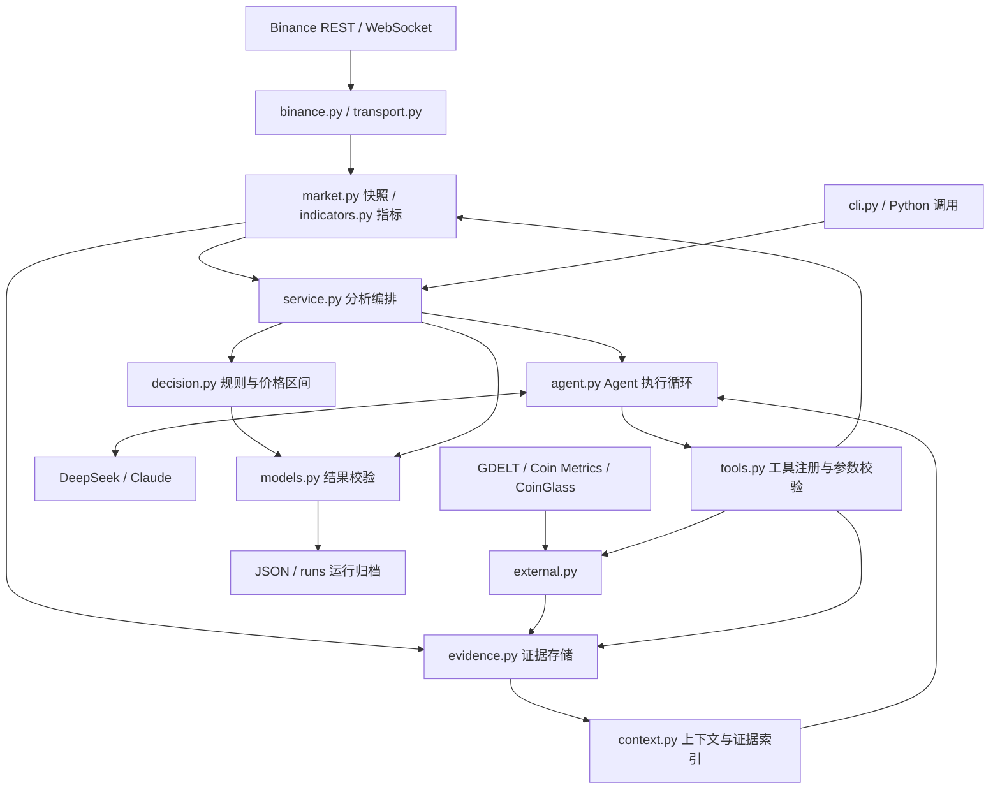
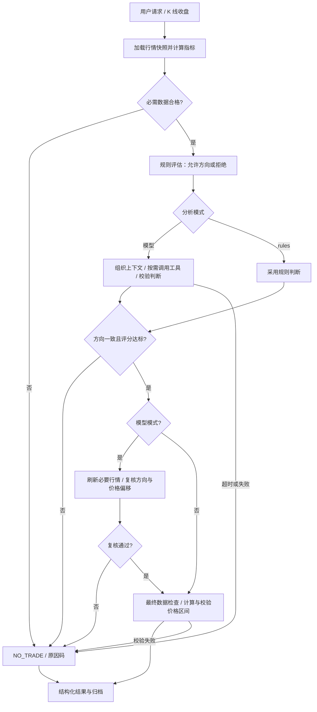

# Alpha-Pulse

**From Market Data to Explainable Trading Decisions.**

Alpha-Pulse 是一个以多金融市场为长期目标、由 AI Agent 驱动的实时市场分析与交易决策辅助项目。它希望将分散的行情、技术指标、资金与持仓、链上及消息面信息，转化为**有依据、可解释、可追溯的市场判断**。

项目让程序负责数据与数值计算，让规则约束分析边界，让 Agent 按需补充证据、解释机会与风险。用户可以获得带有效期的方向参考及入场、止盈、止损区间，也可以得到明确的“暂不交易”（`NO_TRADE`）结论。

> **当前状态：早期研发 / v0.1.0。** 真实行情分析目前支持 **Binance USD-M 永续合约**，提供 CLI 与 Python 入口。多金融市场、完整价格行为分析、回测与自动化评估属于后续方向；当前不执行交易。

[为什么需要](#motivation) · [核心功能](#features) · [系统架构](#architecture) · [Agent 原理](#how-it-works) · [价格行为](#decision-logic) · [技术栈](#tech-stack) · [快速开始](#quick-start) · [发展路线](#roadmap)

<a id="motivation"></a>

## 为什么需要 Alpha-Pulse · Motivation

金融分析需要同时理解价格、成交量、持仓、资金费率和市场事件。成熟的行情与交易平台提供了丰富工具，但将这些信息组织成一致、及时且可复查的分析，仍需要用户投入大量精力。

| 常见困难 | Alpha-Pulse 的探索方向 |
| --- | --- |
| 信息分散，需要在多个来源之间切换 | 用统一工具采集证据，保留来源、时间与可用状态。 |
| 能看到涨跌，却难以理解指标和价格结构 | 将计算结果组织成方向、依据、风险与关键价格区间。 |
| 数据持续变化，分析容易滞后 | 用收盘事件触发分析，并在模型分析后复核最新行情。 |
| 情绪可能影响判断与执行一致性 | 用明确规则检查条件，允许证据不足时保持观望。 |
| 信号缺少解释，事后难以复查 | 记录分析理由、证据引用、规则路径和运行产物。 |

项目关注的是辅助理解与决策过程。模型解释、规则命中和分析评分都需要通过独立评估检验，不能直接等同于策略有效性或收益保证。

<a id="features"></a>
## 核心功能 · Features

### 当前已实现

| 类别 | 能力 | 实现范围 |
| --- | --- | --- |
| 行情接入 | WebSocket K 线订阅；REST 历史 K 线与成交量查询；指定币种和周期 | 支持历史分页、去重、排序、缺口与截断标记；实时流区分形成中与已收盘 K 线。 |
| 市场参与数据 | 盘口、主动成交、标记价格、资金费率、持仓量与多空比 | 盘口为 100 档快照；主动成交为最近 500 条聚合成交，覆盖时长随活跃度变化。 |
| 技术分析 | EMA9/21/50、RSI14、MACD、ATR14、布林带、滚动 VWAP、量比 | 根据已收盘 K 线计算；近 20 根高低点提供基础支撑阻力参考。 |
| 规则与风险检查 | 数据质量、点差、深度、波动率、趋势、资金费率与方向条件 | 输出价格区间按 tick size 对齐，风险收益比计入配置的手续费和滑点。 |
| Agent 分析 | DeepSeek / Claude 适配、多轮工具调用、动态补充证据 | 单 Agent 执行循环；支持参数校验、调用预算、超时、结构校验和失败降级。 |
| 补充数据 | GDELT 新闻标题与链接、Coin Metrics 日频链上指标、CoinGlass 聚合爆仓 | 新闻不核验正文；默认链上映射 BTC、ETH、LTC、BCH、DOGE；爆仓查询需要密钥及对应权限。 |
| 输出与归档 | JSON 结论、证据、规则路径、行情快照及模型调用轨迹 | CLI 单次分析、持续分析、离线演示和 Python 调用均可使用。 |

数据处理目前采用每次分析加载 REST 快照、实例内缓存交易对元数据和本地证据归档，尚无共享行情缓存或数据库。实时订阅负责触发与事件输出，尚未构建持续合并 REST / WebSocket 的统一行情存储。

### 待实现能力

完整价格行为识别、社交媒体接入、多 Agent 协作、多市场适配与历史评估尚未实现，详见 [Roadmap](#roadmap)。

<a id="architecture"></a>
## 系统架构 · Architecture

当前后端采用 Python 模块化结构，由 `service.py` 显式组织分析流程。数据获取、确定性计算、模型判断与输出校验各有边界，便于分别测试和替换；目前行情接口及结果契约仍与 Binance 市场绑定，通用多市场适配层需要后续建设。



| 逻辑职责 | 主要模块 | 设计目的 |
| --- | --- | --- |
| 数据接入 | `binance.py`、`external.py`、`transport.py` | 集中处理请求、代理、超时、重试与来源差异。 |
| 数据处理 | `market.py`、`indicators.py`、`evidence.py` | 检查时间、完整度和数据新鲜度，保留可追溯的输入。 |
| 分析工具 | `tools.py` | 通过有类型约束的工具暴露数据能力，避免模型直接操作任意接口。 |
| 分析与决策 | `service.py`、`agent.py`、`context.py`、`decision.py` | 区分流程编排、工具选择、上下文管理与确定性规则。 |
| 应用输出 | `cli.py`、`models.py` | 提供命令行、Python 和稳定的 JSON 契约；Web API 待实现。 |

```text
alpha-pulse/                    # 当前 Git 仓库
├── src/alpha_pulse/            # 数据、规则、Agent、CLI 与配置
│   └── default_decision_tree.json
├── tests/                     # 数据、决策、实时流及模型适配测试
├── examples/                  # 合成结果与 JSON Schema
├── scripts/export_examples.py # 示例导出
├── docs/                      # 产品蓝图与设计提案
├── .env.example               # 配置模板
├── LICENSE                    # Apache License 2.0
└── pyproject.toml / uv.lock    # Python 依赖与锁文件
```

<a id="how-it-works"></a>
## AI Agent 工作原理 · How It Works

### 从行情到分析结论

1. **获取市场状态**：单次命令或 K 线收盘事件触发分析。系统并发加载指标预热 K 线、近半小时 1 分钟行情、盘口、成交和衍生品数据，并检查本地时钟与数据完整度。
2. **建立上下文并执行规则**：程序计算指标，评估数据新鲜度和规则条件。上下文包含分析目标、周期、快照、规则结果与证据索引；必需行情不合格时立即返回 `no_trade`。
3. **按需补充证据**：Agent 根据尚未解决的问题选择工具，例如补充更高周期 K 线、刷新持仓数据，或查询新闻和链上背景。这是模型可选择的工具路径，并非每次必跑的固定研究流程。
4. **形成结构化判断**：模型提交方向、理由、风险、评分和证据 ID。程序验证结构及引用是否存在、是否可用；输出不合格时在剩余轮次内要求修复。模型只能认可规则允许的方向，或选择观望。
5. **发布前复核**：符合方向与评分要求的模型结果会触发必要行情刷新。规则方向改变、数据过期或价格偏移超过默认 `0.75 ATR` 时返回 `no_trade`；通过后由程序计算价格区间并校验净风险收益比。
6. **保存结果**：输出 JSON，归档实际执行阶段产生的快照、证据和调用记录。默认有效期为 30 分钟；目前尚无到期自动评分或发布后的持续失效监控。



当前其他规则拒绝（如点差过大、信号冲突）仍可能进入模型环节，但无法因此获得方向性结果；提前结束这些无效调用是待优化项。

### 工具与上下文管理

| 工具 | 用途 |
| --- | --- |
| `get_klines` | 查询指定周期或区间，最多 5000 根，明确标记分页、缺口与截断。 |
| `get_order_book` / `get_order_flow` / `get_derivatives` | 刷新盘口、实际主动成交与衍生指标。 |
| `search_news` / `get_onchain` / `get_liquidations` | 按需获取新闻、链上与爆仓背景。 |
| `assess_evidence` / `read_evidence` / `save_note` | 重算证据质量、分页读取原始数据、保留简短工作笔记。 |

Agent Harness 是本项目的执行循环，不是多 Agent 框架。默认最多 **6 轮模型请求、16 次工具调用、180 秒总分析时间**；这些是配置预算，不是性能指标，目前没有按金额控制调用成本。

原始证据保存在磁盘，模型主要读取摘要和索引。上下文超过 UTF-8 字节预算时，移除完整的旧工具调用与结果对，保留任务、规则、快照、索引和笔记，避免工具历史失配。外部文本被标记为不可信数据；轨迹不记录凭据或模型私有思考块。

`watch` 串行分析，并以容量为 1 的队列合并分析期间的新收盘事件，避免任务积压。WebSocket 支持退避重连、倒序事件过滤与重复收盘过滤；重连后的分析重新读取近期 REST 历史，不逐根补跑错过的预测。

### 结果与不确定性

| 输出 | 含义 |
| --- | --- |
| `status` / `direction` | `trade` 搭配 `long` 或 `short`；`no_trade` 搭配 `neutral`。`trade` 是分析状态，不代表已下单。 |
| `entry_zone` / `take_profit_zone` / `stop_loss_zone` | 价格区间的 `low/high`；观望时全部为 `null`。 |
| `valid_from` / `valid_until` | 分析有效时间窗口，使用 UTC 毫秒。 |
| `rationale` / `risks` / `evidence` / `decision_path` | 解释、风险、证据引用与规则检查记录。 |
| `reason_code` / `market_regime` | 区分无机会、数据不足、模型失败等情形；故障不会统一解释成震荡。 |
| `confidence` | 未校准分析评分，**不是上涨概率、胜率或收益预测**。 |

查看完整合成示例：[偏多](examples/prediction.long.json)、[偏空](examples/prediction.short.json)、[观望](examples/prediction.ranging.json)，以及 [JSON Schema](examples/prediction.schema.json)。运行产物位于 `runs/<run_id>/`，包括 `prediction.json`、`run.json` 和按执行阶段生成的快照、证据及 `trace.jsonl`。

当前引用校验尚不验证“每条结论是否由引用内容支持”；动态取证也尚未实现严格的历史时点隔离。新闻索引时间不等于发布时间，日频链上信息不等于分钟级资金流，缺失数据也不等于对应事件没有发生。

<a id="decision-logic"></a>
## 规则决策与价格行为 · Decision Logic & Price Action

当前 [默认决策树](src/alpha_pulse/default_decision_tree.json) 本质上是可配置的条件检查：先过滤数据质量、点差、流动性、波动率、趋势和资金费率，再检查 EMA、MACD、RSI、主动成交与盘口方向的一致性。模型认可方向后，程序以 ATR 和风险参数构建价格区间。

**Al Brooks 价格行为分析目前是规划方向，尚未完整实现。** 现有趋势特征和近期高低点，并不构成对其方法的完整实现。后续拟围绕趋势与交易区间、趋势延续与反转、突破与假突破、回调与确认、支撑阻力，以及连续 K 线的上下文关系，逐步定义可测试的市场情景。相关概念可参考 [Brooks 官方价格行为课程目录](https://www.brookstradingcourse.com/trade-forex-price-action/)。

| 组成 | 职责 |
| --- | --- |
| 规则 / 决策树 | 控制条件、证据资格、方向许可与风险过滤。 |
| 价格行为分析（规划） | 从价格及连续 K 线结构识别市场状态与候选情景，明确确认条件和反证。 |
| LLM Agent | 选择工具、组织证据、解释分歧和风险，形成可读且有引用的判断。 |

决策树不等于价格行为理论，LLM 推理也不等于已验证的量化策略。引入新情景时，应同时定义识别规则、数据要求、失效条件和评估样本；当前默认规则尚未经过回测。

<a id="tech-stack"></a>
## 技术栈 · Tech Stack

以下来自实际依赖与代码，不包含尚未采用的技术选型。

| 类别 | 当前技术 |
| --- | --- |
| 后端 | Python 3.11+、asyncio、Pydantic 2、pydantic-settings、argparse |
| AI / Agent | Anthropic Python SDK；Claude 与 DeepSeek Anthropic 兼容接口；自建 Agent Harness |
| 网络与实时通信 | httpx、websockets、python-socks；Binance REST / WebSocket 客户端 |
| 市场与补充数据 | Binance USD-M、GDELT、Coin Metrics Community、CoinGlass V4、可配置链上 JSON 适配地址 |
| 存储与缓存 | 本地 JSON / JSONL 文件、内存证据索引和实例级元数据缓存；无数据库、Redis 依赖 |
| 工程工具 | uv、Hatchling、pytest、pytest-asyncio、Ruff |

当前通过 CLI 或 Python 入口运行，没有 HTTP 服务、工作流框架依赖或 Docker Compose 一键部署。

<a id="quick-start"></a>
## 快速开始 · Quick Start

### 1. 环境与安装

运行项目需要 **Python 3.11+、uv、Git**。无需启动数据库、缓存或消息队列。

```bash
git clone https://github.com/luckdogone/alpha-pulse.git
cd alpha-pulse
uv sync --dev
```

### 2. 先运行离线演示

无需模型密钥或市场网络连接，即可验证程序与输出契约：

```bash
uv run alpha-pulse demo --scenario long
uv run alpha-pulse demo --scenario ranging
uv run alpha-pulse schema
```

前两条命令应分别输出合成的偏多和观望 JSON，`engine=demo`；运行目录会产生结果文件。演示只验证数据契约与流程，不代表市场预测表现。

### 3. 配置真实数据与模型

首次使用复制配置，已有 `.env` 时直接编辑：

```bash
cp -n .env.example .env
```

[配置模板](.env.example) 使用 DeepSeek；填写自己的密钥，模型名和接口地址可沿用模板配置：

```dotenv
MODEL_PROVIDER=deepseek
DEEPSEEK_API_KEY=replace_with_your_key

# 直连时清空代理；需要代理时填写自己的地址
HTTP_PROXY=
HTTPS_PROXY=
ALL_PROXY=
BINANCE_PROXY=
```

模板含本地代理配置，务必按自己的环境修改。环境变量优先于 `.env`；币安代理优先级为 `BINANCE_PROXY` → `HTTPS_PROXY` → `HTTP_PROXY` → `ALL_PROXY`。如果系统环境中已有代理，仅清空 `.env` 不会覆盖它。

| 配置 | 说明 |
| --- | --- |
| `MODEL_PROVIDER` | `deepseek` 或 `claude`；示例文件选择前者，代码未配置时默认后者。 |
| `DEEPSEEK_API_KEY` / `ANTHROPIC_API_KEY` | 按所选模型提供方填写。Claude 使用 `MODEL_PROVIDER=claude`；`rules` 模式不需要模型凭据。 |
| `DEEPSEEK_MODEL` / `ANTHROPIC_MODEL` | 模型名称；需要账户具备访问所配置模型的权限。 |
| `COINGLASS_API_KEY` | 可选；爆仓查询还取决于套餐与时间粒度权限。默认交易所范围为 Binance、OKX、Bybit，不代表全市场。 |
| `ONCHAIN_URL_TEMPLATE` / `ONCHAIN_API_KEY` | 可选的自定义链上接口；不设置时使用内置社区数据源。 |
| `DECISION_TREE_PATH` / `ARTIFACTS_DIR` | 自定义规则文件与运行产物目录；默认使用随包规则及 `runs/`。 |

当前 Binance 接入只使用公开市场数据，不需要交易所账户密钥。GDELT 与内置 Coin Metrics 社区查询无需项目侧配置密钥，但仍受外部服务可用性限制。模型分析会调用外部模型服务；请将自己的凭据保留在被 Git 忽略的 `.env` 中。

### 4. 运行分析

当前分析通过 CLI / Python 进程运行，没有需要访问的 HTTP 端口。先检查市场连接，再选择运行方式：

```bash
# 检查配置与 Binance REST / WebSocket，不调用模型
uv run alpha-pulse doctor

# 真实行情 + 确定性规则，无需模型密钥
uv run alpha-pulse analyze --symbol BTCUSDT --interval 1m --engine rules

# 真实行情 + 已配置的模型，另存结果
uv run alpha-pulse analyze --symbol BTCUSDT --interval 1m --output runs/latest.json

# 按 K 线收盘事件持续分析，标准输出为逐行 JSON
uv run alpha-pulse watch --symbol BTCUSDT --interval 1m

# 仅订阅实时流，收到 3 个事件后退出
uv run alpha-pulse stream --symbol BTCUSDT --interval 1m --count 3

# 查询历史 K 线；区间查询可追加 --start-ms / --end-ms，单位为 UTC 毫秒
uv run alpha-pulse klines --symbol BTCUSDT --interval 15m --limit 100
```

`doctor` 不验证模型账户权限。正常分析也可能得到 `no_trade`；请结合 `reason_code` 判断是机会不合适还是运行故障。`stream` 输出带 `closed` 标记的事件；`watch` 可用 Ctrl+C 结束。更多参数见 `uv run alpha-pulse --help`。

Python 调用入口：

```python
import asyncio
from alpha_pulse.config import Settings
from alpha_pulse.service import analyze

async def main():
    result = await analyze(Settings(), symbol="BTCUSDT", interval="1m", engine="rules")
    print(result.model_dump_json(indent=2))

asyncio.run(main())
```

### 5. 开发检查

在项目根目录运行：

```bash
uv run pytest
uv run ruff check .
```

<a id="roadmap"></a>

## 发展路线 · Roadmap

以下阶段是建议的演进方向，会根据技术验证和社区反馈调整，不代表确定的交付承诺或发布时间。

### Phase 1 · 系统运行基线与稳定性

- 增强已有重试、断线重连和异常恢复，改进历史与实时数据的一致性及缺口处理。
- 建设可复用行情缓存与数据更新时间管理，补齐阶段耗时、调用成本和故障观测。
- 完善源码分发与本地运行流程，增加 Web API / 事件推送，便于其他应用集成分析结果。

### Phase 2 · Agent 分析能力增强

- 优化工具选择与任务编排，对规则明确拒绝的分析提前结束模型调用。
- 逐步引入 Al Brooks 价格行为情景识别，明确确认条件、反证与失效条件。
- 加强逐条结论与证据的支持关系校验、不确定性表达和 `NO_TRADE` 判断；按评估需要探索专业 Agent 分工。

### Phase 3 · 分析结果评估与验证

- 区分分析快照与发布检查快照，记录数据实际可用时间，建立历史回放与可复现评估流程。
- 跟踪分析到期结果，对比规则、模型和工具组合，研究评分校准。
- 在适用场景开展回测，计入手续费、滑点，控制前视偏差和数据泄漏；评估覆盖率与失败场景。

### Phase 4 · 多数据源拓展

- 接入其他交易所或行情服务，形成统一的数据契约、来源标记和质量管理。
- 扩展已有日频链上数据及新闻标题检索，研究正文获取、事件去重、时效性与跨源核验。
- 研究社交媒体与其他消息面数据，在来源、权限和数据质量可控的条件下接入。

### Phase 5 · 多金融市场支持

- 从加密货币及衍生品逐步探索美股、港股、韩股、A 股，以及能源、大宗商品和其他具备合适数据来源的市场。
- 通过独立数据适配器接入各市场服务，处理交易时间、时区、计价单位、价格精度、交易规则与数据结构差异。
- 扩展目前绑定 Binance 的领域模型、规则与评估流程；多市场能力不依赖 Binance 提供上述证券或商品市场数据。

## 开源许可 · License

本项目采用 [Apache License 2.0](LICENSE) 开源许可。完整条款见根目录的 `LICENSE` 文件。


#### 欢迎交流反馈，有意见或者想法都可以联系我沟通

扫码添加微信或者邮件联系：luckdogone@hotmail.com


